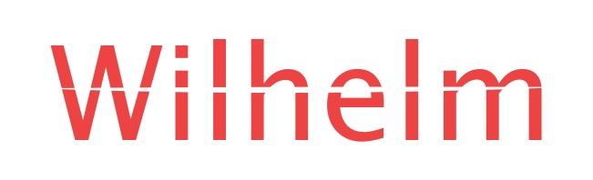

<p align="center">

<br>
Wilhelm
<br>
<pre align="center">Version checker for iOS app featuring server-side configuration</pre>
</p>

Usage
---
```swift
  import Wilhelm
// func application(_ application: UIApplication, didFinishLaunchingWithOptions launchOptions: [UIApplicationLaunchOptionsKey: Any]?) -> Bool {
    Wilhelm.handle(app: "com.tencent.xin")
// return true
//}
```
install
---
###Carthage
```
github "CodeEagle/Wilhelm"
```
Wiki
---
```swift
	/// handle works
    ///
    /// - parameter bundleIdentifier: bundle id of querying app, such as com.abc.com
    /// - parameter extraInfo:        server side control info of app
    /// - parameter language:         language to show, default cn
    /// - parameter ignore:           custom ignore title
    /// - parameter update:           custom update title
    public static func handle(app bundleIdentifier: String, 
    						  extraInfo: ServerSideAppControl? = nil,
    						  language: ITCLanguage = .cn, 
    						  customIgnore ignore: String? = nil, 
    						  customUpdate update: String? = nil) { ... }
```
Donations
---
<pre>
<p align="center">

</p>
</pre>
License
---
Wilhelm is released under the MIT license. See LICENSE for details.